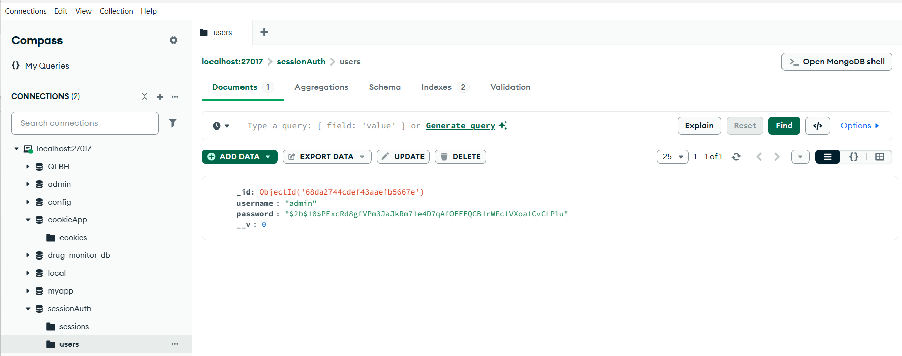
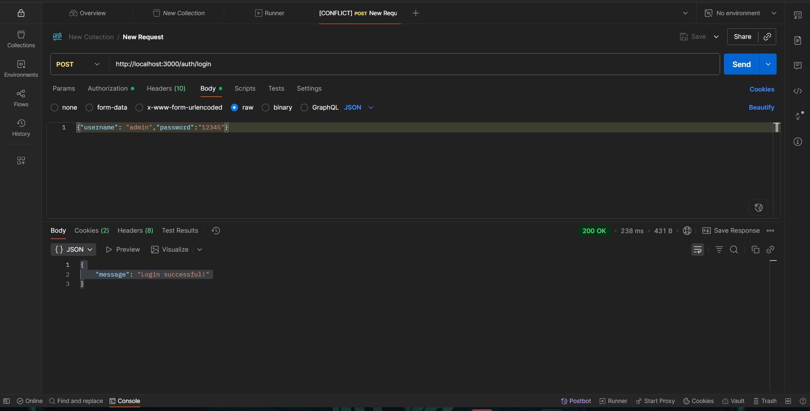
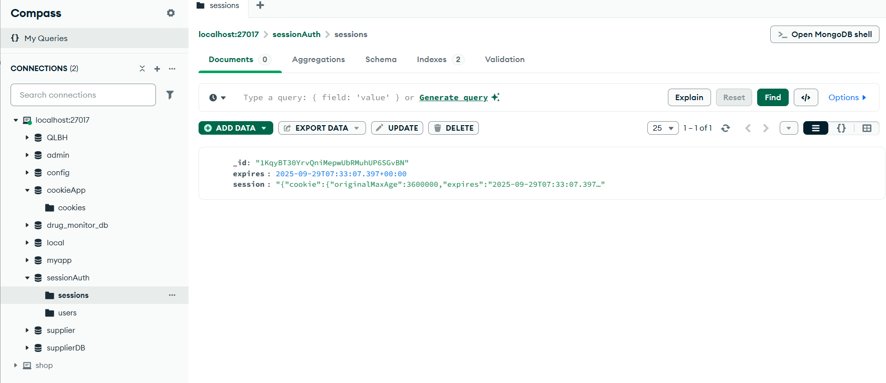
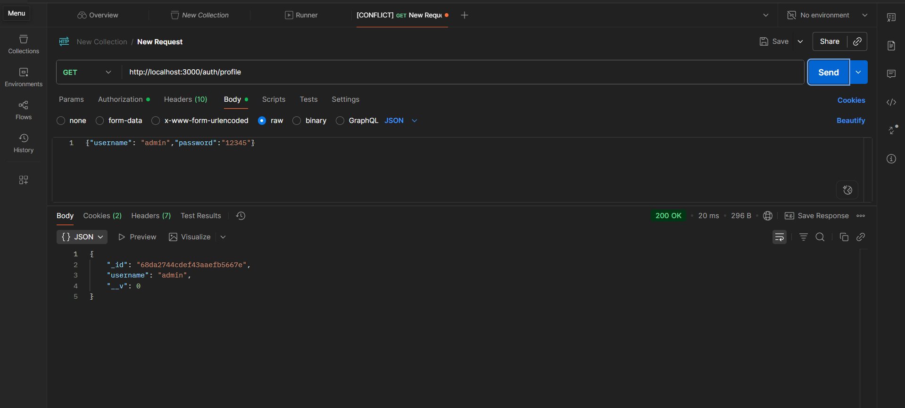
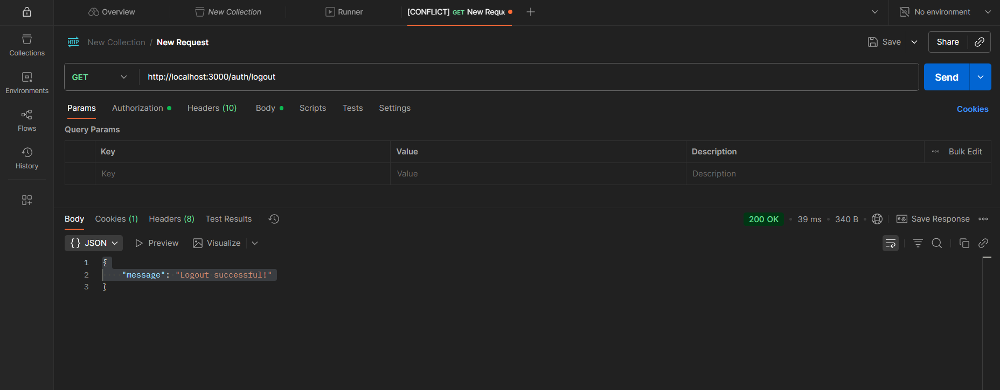

# COOKIE & SESSION AUTHENTICATION

## Bài lab thực hành xác thực bằng **Cookie + Session** trong NodeJS.

---

## ⚙️ Run project
```bash
npm install
node app.js
```

---

## 🧪 Test with Postman

### Register
**POST** `http://localhost:3000/auth/register`  
Body → raw (JSON):
```json
{ "username": "admin", "password": "123456" }
```
📸 

---
###  Test xem tài khoản đã được đăng ký chưa bằng mongo compass
**POST** `http://localhost:3000/auth/login`  
📸 

---

###  Login
**POST** `http://localhost:3000/auth/login`  
📸 

---
###  Sau khi đăng nhập sesion sẽ được tạo và lưu trong database
**POST** `http://localhost:3000/auth/login`  
📸 

---
###  Profile
**POST** `http://localhost:3000/auth/login`  
📸 

---

### Logout
**GET** `http://localhost:3000/auth/loguot`  
📸 

---
### Session đã được xóa trong database
**GET** `http://localhost:3000/auth/loguot`  
📸 

---


## 📘 Author
**22670361 - Võ Thị Cẩm Tú**
